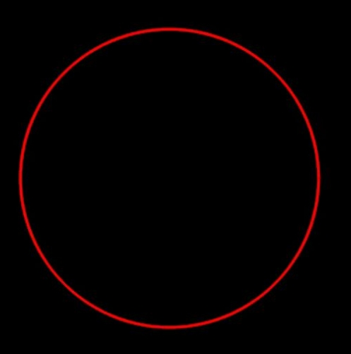
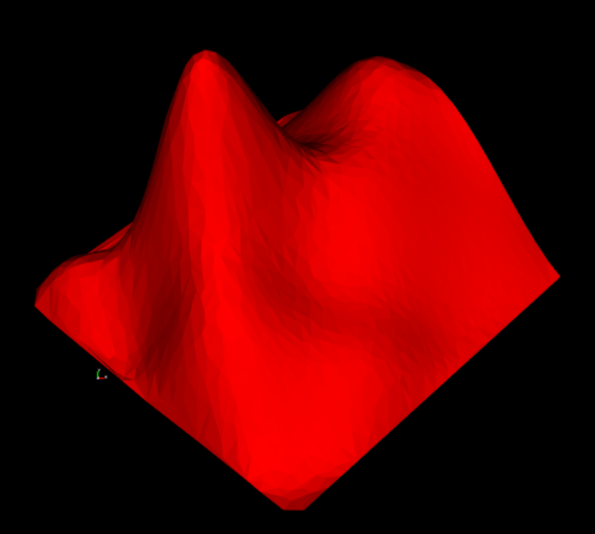
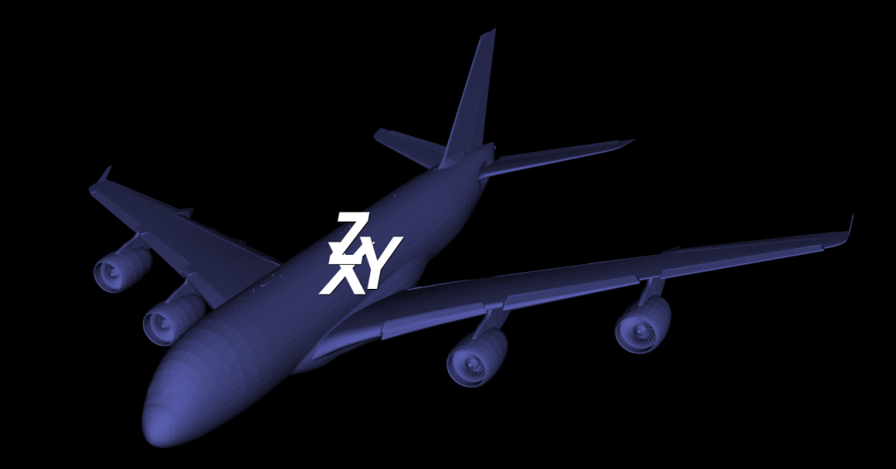

## Introduction
**LNLibViewer is a 3d viewer matches C++ NURBS algorithm library LNLib**  This project is construct based on [VTK](https://vtk.org/)

**Curve:** 
 
**Surface:** 
 
**Mesh:** 

## LNLib
**LNLib is a C++ NURBS Algorithms Library.**  These algorithms are primary referenced from [The NURBS Book 2nd Edition](https://link.springer.com/book/10.1007/978-3-642-97385-7).  The APIs are re-designed to make it more friendly to users.   
For more details, please see [LNLib](https://github.com/BIMCoderLiang/LNLib)

## Run LNLibViewer
Please run build.bat first and it will construct solution by CMake.

## Contributing
Welcome join this project including discussions in **Issues** and make **Pull requests**.

## Owner
LNLib is created by Yuqing Liang (BIMCoder Liang).

- bim.frankliang@foxmail.com
- 微信公众号：**BIMCoder**

## License
The source code is published under [GNU General Public License v3.0](https://www.gnu.org/licenses/), the license is available [here](LICENSE).

